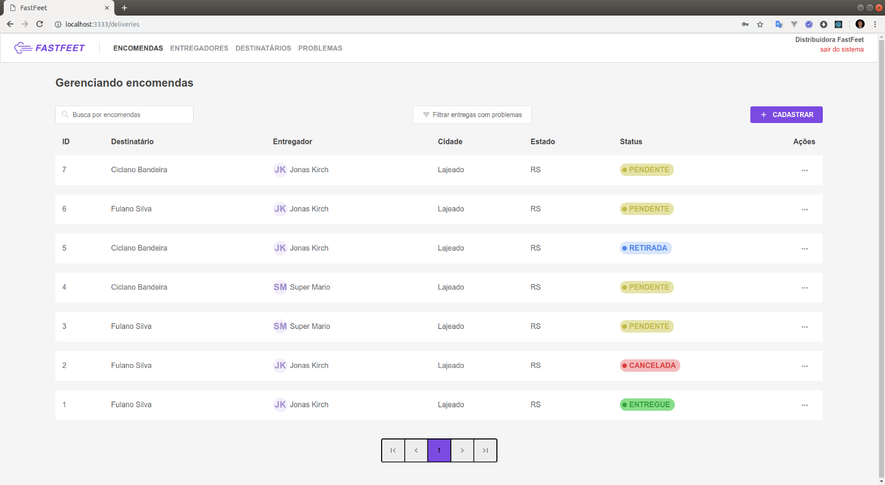
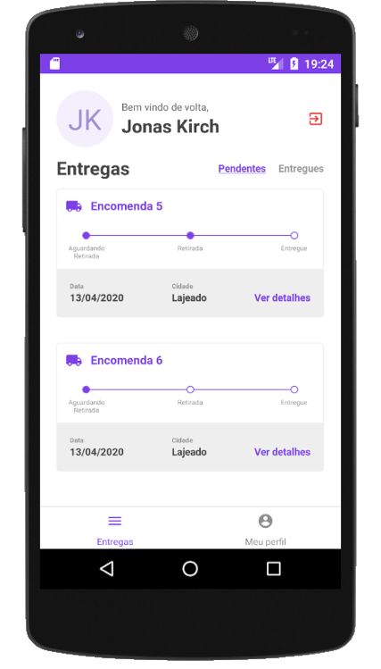

<h1 align="center">
  
</h1>

<h3 align="center">
  FastFeet - Gerenciador de Entregas
</h3>

<p align="center">
  <a href="#projeto">Projeto</a>&nbsp;&nbsp;&nbsp;|&nbsp;&nbsp;&nbsp;
  <a href="#instalação-e-execução">Instalação e execução</a>&nbsp;&nbsp;&nbsp;
</p>
<br />
<p align="center">
    
  
</p>

## Projeto

<p>Esse projeto é uma aplicação completa (backend, frontend e mobile) para gerenciamente de entregas.</p>
<p>Ele faz parte do desafio final do bootcamp GoStack da <a href="https://rocketseat.com.br/" target="_blank">RocketSeat</a>.</p>

## Instalação e Execução

### Backend e frontend

Instalação via docker containers.

1. Copie o arquivo `backend/.env.example` para `backend/.env` e preenche as variaveis que faltam;

2. Rode o comando abaixo para criar os container: 
 ```
 docker-compose up -d --build
 ```
3. Rode o comando abaixo para criar as tabelas do banco de dados:
```
docker-compose run fastfeet-app yarn sequelize db:migrate
```
4. Rode o comando abaixo para criar o usurio padrão:
```
docker-compose run fastfeet-app yarn sequelize db:seed:all
``` 
5. Acesse a aplicação pelo endereço `http://localhost:3333`. Usuário: `admin@fastfeet.com` Senha: `123456`.

### Mobile

**Obs: Somente Android**.

1. No diretório `mobile` rode o comando `yarn` para instalar as dependêcias;

2. Copie o arquivo `.env.example` para `.env` e altere `localhost` para o `ip de sua máquina`;

2. Rode o comando `yarn start`;

3. Rode o comando `yarn android`.
